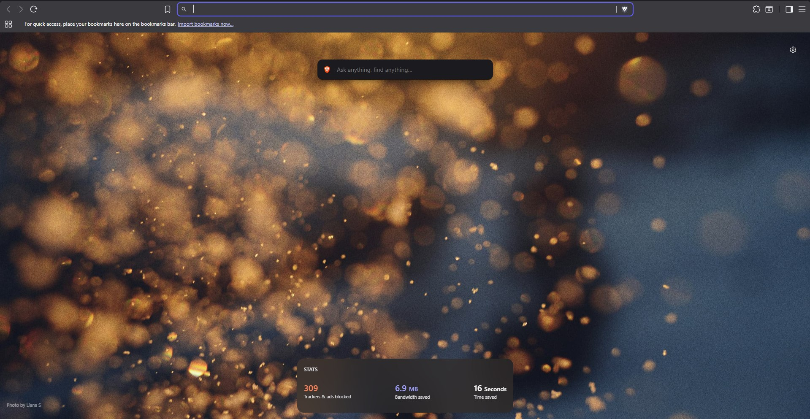

# BraveDebloater


[](https://github.com/osfv/BraveDebloater/actions/workflows/ci.yml)
[](LICENSE)

<p align="center">
  
</p>

<p>
  
  <strong>BraveDebloater</strong> is a safety-first Windows PowerShell tool for trimming Brave Browser extras while keeping Brave Shields intact.
</p>

<p>
   Windows-first
  &nbsp;·&nbsp;
   PowerShell-native
  &nbsp;·&nbsp;
   Open source
</p>

It uses official Brave/Chromium enterprise policies where possible, starts in dry-run mode, writes backups before applying changes, and includes an undo path. No updater disabling, no host-file edits, no extension removal, and no Shield allowlisting.

## What It Debloats

- Brave Rewards, Wallet, VPN, Leo AI Chat, News, Talk, Playlist, Speedreader, and Wayback prompts
- Brave telemetry surfaces such as P3A, stats ping, and Web Discovery
- Chromium metrics, URL-keyed collection, Privacy Sandbox prompts, remote search suggestions, network prediction, and remote spellcheck
- Aggressive preset extras such as background mode, promotions, Browser Labs, new tab cards, shopping list, QR generator, translate prompts, autofill, and the Google search side panel

Optional profile preference cleanup can also hide some new tab sponsored/background and toolbar surfaces when Brave stores those preferences in per-profile `Preferences` JSON.

## Quick Start

Preview the aggressive preset:

```powershell
.\Invoke-BraveDebloat.ps1 -Preset Aggressive
```

List the policies and optional profile preference patches without running the dry-run/apply flow:

```powershell
.\Invoke-BraveDebloat.ps1 -Preset Aggressive -List -IncludeProfilePreferences
```

Apply it for the current Windows user:

```powershell
.\Invoke-BraveDebloat.ps1 -Preset Aggressive -Apply
```

Apply it and enforce a safe Shields baseline:

```powershell
.\Invoke-BraveDebloat.ps1 -Preset Aggressive -LockShields -Apply
```

PowerShell `-WhatIf` is supported as a no-write preview even when `-Apply` is present:

```powershell
.\Invoke-BraveDebloat.ps1 -Preset Aggressive -Apply -WhatIf
```

After applying, restart Brave and open `brave://policy` to verify the policies.

## Presets

- `Core`: Brave-specific bloat and Brave telemetry.
- `Privacy`: `Core` plus privacy-preserving policy defaults.
- `Aggressive`: `Privacy` plus more UI and convenience surface cleanup.
- `-LockShields`: optional add-on that enforces default ad blocking, standard fingerprinting protection, HTTPS upgrades, and stricter referrer behavior.

By default, the tool does not lock Shield behavior. It also refuses to apply policies that disable Shields, add Shield-disabled URLs, weaken Safe Browsing, or disable updates.

## Profile Preferences

Registry policies are the main path because they are supported and visible in `brave://policy`. For cosmetic cleanup that Brave stores per profile, close Brave and run:

```powershell
.\Invoke-BraveDebloat.ps1 -Preset Aggressive -IncludeProfilePreferences -Apply
```

If Brave is running, profile preference cleanup is skipped to avoid writing files that Brave may overwrite.

## Restore

Every applied run creates a JSON backup in `backups/` unless `-NoBackup` is used for policy-only changes.

Preview a restore:

```powershell
.\Invoke-BraveDebloat.ps1 -UndoFromBackup .\backups\BraveDebloater-YYYYMMDD-HHMMSS-fff.json
```

Apply a restore:

```powershell
.\Invoke-BraveDebloat.ps1 -UndoFromBackup .\backups\BraveDebloater-YYYYMMDD-HHMMSS-fff.json -Apply
```

Restore validates backup metadata before writing. Registry restores are limited to Brave policy keys, and profile file restores are limited to `Preferences` files under the selected `-ProfileRoot`.

## Machine-Wide Mode

Current-user policy is the default and does not require administrator rights. For machine-wide policy, run PowerShell as administrator:

```powershell
.\Invoke-BraveDebloat.ps1 -Preset Aggressive -Scope LocalMachine -Apply
```

## Sources

Policy names and values are based on Brave's official Group Policy documentation and Brave policy templates:

- https://support.brave.app/hc/en-us/articles/360039248271-Group-Policy
- https://brave-browser-downloads.s3.brave.com/latest/policy_templates.zip

## Project Checks

Run the built-in manifest and syntax checks:

```powershell
.\scripts\Test-PolicyManifest.ps1
.\scripts\Test-Behavior.ps1
```
